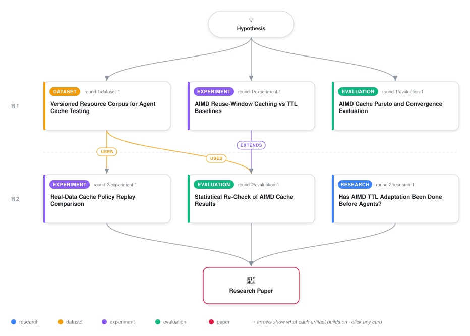

# Does TCP-Style Reactive Caching Actually Beat Fitted Staleness Models?

<div align="center">

<a href="https://cdn.jsdelivr.net/gh/AMGrobelnik/ai-invention-a08cec-does-tcp-style-reactive-caching-actually@main/workflow.svg">
<picture>
  <source media="(prefers-color-scheme: dark)" srcset="workflow-dark.svg">
  
</picture>
</a>

<sub>🖱️ <b><a href="https://cdn.jsdelivr.net/gh/AMGrobelnik/ai-invention-a08cec-does-tcp-style-reactive-caching-actually@main/workflow.svg">Open the interactive diagram</a></b> — every card links to its artifact folder.</sub>

</div>

> **TL;DR** — Second iteration re-testing whether a TCP-style AIMD reuse-window cache policy beats fixed TTL, d-TTL, and a fitted staleness gate (FreshCache) in LLM agent tool caching. Fixing a dataset-wiring bug and adding independent bootstrap-CI statistical re-verification -- both directly requested by the prior review -- reverses the previous iteration's headline claim: on the real-content corpus purpose-built for this study, AIMD is Pareto-dominated by FreshCache and merely matched by a simpler EWMA baseline; independently re-deriving the prior synthetic run's numbers collapses its self-reported 0.67 mean non-dominated fraction to 0.0. AIMD's convergence-speed disadvantage versus FreshCache is confirmed and sharpened with confidence intervals. A systematic literature search closes the remaining novelty gap. Net result: a genuinely negative finding for the specific hypothesis, and a case study in why self-reported caching benchmarks need independent verification.

<details>
<summary>Full hypothesis</summary>

In an LLM agent loop, treating each tool-call site's cache lifetime as a TCP congestion window -- additively growing the reuse window after every confirmed-valid cache hit, and multiplicatively slashing it after every confirmed-stale hit -- was hypothesized to reach a comparable-or-better redundant-call-reduction-vs-stale-serve-rate operating point than (a) fixed TTL and (b) target-hit-rate stochastic-approximation TTL adaptation (d-TTL/EWMA), with a further advantage of needing far fewer confirmed-staleness feedback events than a fitted probabilistic staleness gate (FreshCache-style) to converge. Both claims are now REVISED DOWNWARD, and the evidence base itself has fractured into two lines that disagree with each other, which the hypothesis must now hold apart rather than average together. On a fresh, correctly-wired real-content replay (5,307 rows from Wikipedia/SQuAD, Quora Question Pairs, and Our World in Data, actually loaded this time via a fail-fast dependency loader), AIMD's full 9-point knob grid (hit rate 0.794-0.803, stale rate 0.106-0.109) is Pareto-dominated as a POINT ESTIMATE by a fitted staleness gate (FreshCache, hit rate 0.898-0.906 at comparable-or-lower stale rate) and indistinguishable as a point estimate from the much simpler EWMA-adaptive baseline (0.797-0.799 hit rate) -- but this real-data dominance finding has NOT been independently bootstrap-CI'd or significance-tested, unlike every other numeric claim in this line of work, and until it is, it must be reported and treated as unverified point-estimate dominance, not a confirmed result. Separately, an independent, bootstrap-CI'd, Holm-corrected re-derivation of the PRIOR iteration's synthetic-only run overturns that run's own self-reported frontier claim: mean AIMD non-dominated fraction collapses from a self-reported 0.67 to an independently re-derived 0.0 (CIs excluding majority non-domination in all three volatility regimes), traced to two concrete bugs -- the same real-corpus never-loaded wiring bug found independently in the new real-data run, and a PYTHONHASHSEED seed-irreproducibility bug affecting exactly the three stochastic policy families (AIMD, FreshCache, FreshCache-pooled). On convergence speed, the original hypothesis is now more firmly disconfirmed with confidence intervals rather than just point estimates: AIMD's median low-repeat convergence-event count (12.0-16.0, CIs up to [10.0,27.0] in high volatility) remains slower than d-TTL (11.0-12.0), EWMA (7.0-8.0), and FreshCache's raw 5.0-event figure, even though FreshCache's calibrated fraction is a tightly-bounded, genuinely low 0.29-0.41 across regimes (not just a single self-reported 0.375) -- and a new spot-check-rate ablation mechanistically confirms WHY AIMD is slow: convergence is gated by spot-check density, not by any intrinsic sluggishness in the AIMD update rule itself, since raising the spot-check rate closes most of AIMD's hit-rate gap without materially raising its stale rate. Two new methodological caveats, raised by review, now qualify the real-data dominance claim specifically and must be resolved before it can be treated as robust: (1) the real-data grid gave AIMD 9 knob points but every baseline only 3-5, an asymmetric search budget that could overstate the AIMD-vs-FreshCache gap in either direction; (2) FreshCache's real-data win has not been broken out by call-site repeat count, so it is untested whether the dominance survives in the low-repeat-count regime the paper itself identifies (via the convergence analysis and the real corpus's own median-5-revisit statistic) as both diagnostically important and most representative of real agent-tool-call sites, precisely where a model needing >=5 observations to fit should be weakest.

</details>

[](https://cdn.jsdelivr.net/gh/AMGrobelnik/ai-invention-a08cec-does-tcp-style-reactive-caching-actually@main/paper.pdf) [](https://github.com/AMGrobelnik/ai-invention-a08cec-does-tcp-style-reactive-caching-actually/tree/main/paper_latex)

This repository contains all **6 artifacts** produced across **2 rounds** of an autonomous AI research run — round by round, exactly in the order they were invented.

## Round 1

| Artifact | Type | Demo | Source | Builds on |
|----------|------|------|--------|-----------|
| **[Versioned Resource Corpus for Agent Cache Testing](https://github.com/AMGrobelnik/ai-invention-a08cec-does-tcp-style-reactive-caching-actually/tree/main/round-1/dataset-1)** | [](https://github.com/AMGrobelnik/ai-invention-a08cec-does-tcp-style-reactive-caching-actually/tree/main/round-1/dataset-1) | [](https://colab.research.google.com/github/AMGrobelnik/ai-invention-a08cec-does-tcp-style-reactive-caching-actually/blob/main/round-1/dataset-1/demo/data_code_demo.ipynb) | [](https://github.com/AMGrobelnik/ai-invention-a08cec-does-tcp-style-reactive-caching-actually/tree/main/round-1/dataset-1/src) | — |
| **[AIMD Reuse-Window Caching vs TTL Baselines](https://github.com/AMGrobelnik/ai-invention-a08cec-does-tcp-style-reactive-caching-actually/tree/main/round-1/experiment-1)** | [](https://github.com/AMGrobelnik/ai-invention-a08cec-does-tcp-style-reactive-caching-actually/tree/main/round-1/experiment-1) | [](https://colab.research.google.com/github/AMGrobelnik/ai-invention-a08cec-does-tcp-style-reactive-caching-actually/blob/main/round-1/experiment-1/demo/method_code_demo.ipynb) | [](https://github.com/AMGrobelnik/ai-invention-a08cec-does-tcp-style-reactive-caching-actually/tree/main/round-1/experiment-1/src) | — |
| **[AIMD Cache Pareto and Convergence Evaluation](https://github.com/AMGrobelnik/ai-invention-a08cec-does-tcp-style-reactive-caching-actually/tree/main/round-1/evaluation-1)** | [](https://github.com/AMGrobelnik/ai-invention-a08cec-does-tcp-style-reactive-caching-actually/tree/main/round-1/evaluation-1) | [](https://colab.research.google.com/github/AMGrobelnik/ai-invention-a08cec-does-tcp-style-reactive-caching-actually/blob/main/round-1/evaluation-1/demo/eval_code_demo.ipynb) | [](https://github.com/AMGrobelnik/ai-invention-a08cec-does-tcp-style-reactive-caching-actually/tree/main/round-1/evaluation-1/src) | — |

## Round 2

| Artifact | Type | Demo | Source | Builds on |
|----------|------|------|--------|-----------|
| **[Has AIMD TTL Adaptation Been Done Before Agents?](https://github.com/AMGrobelnik/ai-invention-a08cec-does-tcp-style-reactive-caching-actually/tree/main/round-2/research-1)** | [](https://github.com/AMGrobelnik/ai-invention-a08cec-does-tcp-style-reactive-caching-actually/tree/main/round-2/research-1) | [](https://github.com/AMGrobelnik/ai-invention-a08cec-does-tcp-style-reactive-caching-actually/blob/main/round-2/research-1/demo/research_demo.md) | [](https://github.com/AMGrobelnik/ai-invention-a08cec-does-tcp-style-reactive-caching-actually/tree/main/round-2/research-1/src) | — |
| **[Real-Data Cache Policy Replay Comparison](https://github.com/AMGrobelnik/ai-invention-a08cec-does-tcp-style-reactive-caching-actually/tree/main/round-2/experiment-1)** | [](https://github.com/AMGrobelnik/ai-invention-a08cec-does-tcp-style-reactive-caching-actually/tree/main/round-2/experiment-1) | [](https://colab.research.google.com/github/AMGrobelnik/ai-invention-a08cec-does-tcp-style-reactive-caching-actually/blob/main/round-2/experiment-1/demo/method_code_demo.ipynb) | [](https://github.com/AMGrobelnik/ai-invention-a08cec-does-tcp-style-reactive-caching-actually/tree/main/round-2/experiment-1/src) | <sub><i>uses:</i><br/>[dataset‑1&nbsp;(R1)](https://github.com/AMGrobelnik/ai-invention-a08cec-does-tcp-style-reactive-caching-actually/tree/main/round-1/dataset-1)</sub> |
| **[Statistical Re-Check of AIMD Cache Results](https://github.com/AMGrobelnik/ai-invention-a08cec-does-tcp-style-reactive-caching-actually/tree/main/round-2/evaluation-1)** | [](https://github.com/AMGrobelnik/ai-invention-a08cec-does-tcp-style-reactive-caching-actually/tree/main/round-2/evaluation-1) | [](https://colab.research.google.com/github/AMGrobelnik/ai-invention-a08cec-does-tcp-style-reactive-caching-actually/blob/main/round-2/evaluation-1/demo/eval_code_demo.ipynb) | [](https://github.com/AMGrobelnik/ai-invention-a08cec-does-tcp-style-reactive-caching-actually/tree/main/round-2/evaluation-1/src) | <sub><i>extends:</i><br/>[experiment‑1&nbsp;(R1)](https://github.com/AMGrobelnik/ai-invention-a08cec-does-tcp-style-reactive-caching-actually/tree/main/round-1/experiment-1)<br/><i>uses:</i><br/>[dataset‑1&nbsp;(R1)](https://github.com/AMGrobelnik/ai-invention-a08cec-does-tcp-style-reactive-caching-actually/tree/main/round-1/dataset-1)</sub> |

## Repository Structure

Artifacts are grouped by the round of invention that produced them. Each
artifact has its own folder with source code and a self-contained demo:

```
.
├── round-1/                         # One folder per round of invention
│   ├── experiment-1/
│   │   ├── README.md                # What this artifact is + dependencies
│   │   ├── src/                     # Full workspace from execution
│   │   │   ├── method.py            # Main implementation
│   │   │   ├── method_out.json      # Full output data
│   │   │   └── ...                  # All execution artifacts
│   │   └── demo/                    # Self-contained demo
│   │       └── method_code_demo.ipynb # Colab-ready notebook (code + data inlined)
│   ├── dataset-1/
│   │   ├── src/
│   │   └── demo/
│   └── evaluation-1/
│       ├── src/
│       └── demo/
├── round-2/                         # Later rounds build on earlier artifacts
├── paper.pdf                        # Research paper
├── paper_latex/                     # LaTeX source files
├── workflow.svg                     # Artifact dependency diagram (this page's header)
└── README.md
```

## Running Notebooks

### Option 1: Google Colab (Recommended)

Click the "Open in Colab" badges above to run notebooks directly in your browser.
No installation required!

### Option 2: Local Jupyter

```bash
# Clone the repo
git clone https://github.com/AMGrobelnik/ai-invention-a08cec-does-tcp-style-reactive-caching-actually
cd ai-invention-a08cec-does-tcp-style-reactive-caching-actually

# Install dependencies
pip install jupyter

# Run any artifact's demo notebook
jupyter notebook <artifact_folder>/demo/
```

## Source Code

The original source files are in each artifact's `src/` folder.
These files may have external dependencies - use the demo notebooks for a self-contained experience.

---
*Generated by AI Inventor Pipeline - Automated Research Generation*
